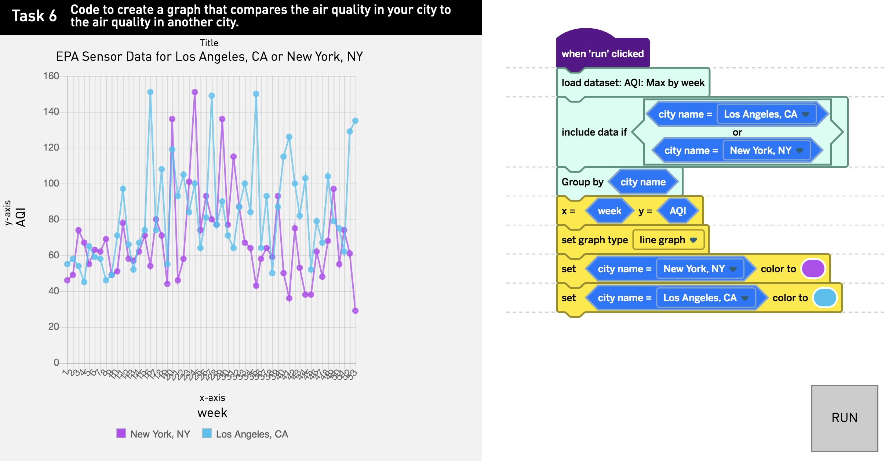

# Amplify

???

Good morning, I’m Ludmila Janda and today I'm going to be talking to you about Teaching Data Cleaning and Visualization with R-inspired Custom Scratch Blocks

I believe my talk was scheduled first in order to ease you into this R-filled day by starting with a more simple interface

I work at Amplify

Amplify is a K-8 education publisher

We have print-based, online, and hands-on materials

I work on our science team and today I’m going to tell you about a science unit that we have developed using scratch blocks to teach data visualization 

---
# Team

One of each

--

- Product manager

--

- Full-stack developer

--

- QA Engineer 

--

- Designer

--

- Data Scientist

???

The team that I am working with on this unit consists of a product manager, a full-stack developer, a QA engineer, a designer, and me

Technically, this work is not my day job at Amplify, I’m a data scientist, but I was asked to join this team 

---
# Scratch

???

So, what is scratch?

--

- Visual programming interface 

???

It’s a visual programming interface 

--

- Developed by the Lifelong Kindergarten Group at the MIT Media Lab

???

developed at MIT

--

- Financially supported by National Science Foundation, Scratch Foundation, Siegel Family Endowment, Google, LEGO Foundation, Intel, Cartoon Network, Lemann Foundation, MacArthur Foundation

???

funded by a lot of big names

--

- Designed especially for ages 8 to 16

???

especially for ages 8 -16, so middle school falls very well into that range

--

- Avoids syntax errors and typos

???

A benefit of scratch is that since you are dragging blocks instead of typing out code, you can avoid a lot of syntax errors and typos

--

- Can use blocks to program games, make animations, and generally create code

???

The blocks can be used to generate code for many uses

--

- **No blocks for cleaning data or making graphs at this point** 

???

though at this point there are no blocks for making graphs

---
# Scratch UI

???

Here is the scratch UI

There are a lot of blocks, the blocks you can see here are the motion blocks

you always starts with this cat, which they call a sprite, though you can set a different sprite, give it a costume, create a background, and so on

---
# Scratch example

???

Here’s an example of a very small thing I made in scratch, within a repeat block i change the background, have the cat move 50 steps, and then have it say hello for one second

This is a gif, which is why it is repeating on a loop, it would not otherwise

You can see here that there is a lot you can do, though this is just scratching the surface of what you can do with scratch

Though there is a lot you can do, scratch blocks don’t allow for graphing, so we forked their repo and made our own blocks to work with data

---
# Our Work

--

- Make computer science and data science accessible

???

So in our work, we wanted to engender interest in computer science and data science and make sure that it felt accessible, especially for underrepresented groups

--

- Create a UI to clean data and make graphs using scratch blocks

???

To do this, we wanted to create a UI for data viz using scratch blocks 

--

- Take inspiration from the tidyverse and grammar of graphics/ggplot2 

???

Once we sat down and started working, we realized we could take inspiration from the tidyverse and the grammar of graphics in order to achieve this

--

- Use in a 10 day middle school science unit (here using weekly EPA air quality data for all cities with sensor data in USA in 2017)

???

We are developing a 10 day middle school science unit where students explore the EPA’s air quality data at the weekly level for all cities with sensor data for the entire year of 2017

---
background-image: url(images/sketch.jpeg)
background-size: 500px
background-position: 50% 50%

???

For the rest of this talk, I want to tell you the story of how the blocks came to be and show some student work that we have observed

I want to point out that while we have moved from my very simple sketch on paper to real blocks and, for the most part, work, we are still in the pilot stage and very much still iterating on this process

---
background-image: url(images/tidy_blocks.png)
background-size: 200px
background-position: 60% 50%

# Tidyverse to Tidy Blocks

.pull-left[
- filter() 

 

- group_by()

 

- mutate()

- summarise()

 

 

 

- select() 

- arrange()

]

???

So here we have our beloved central verbs of dplyr and the blocks that we have developed thus far

First we have the filter block, which we decided we absolutely needed in the UI but changed to have an even more explicit name, especially since students don’t have to type out this name

We changed it to “include data if” and at this point two include data if blocks after another are implicitly and, while we have an explicit or block, though we are considering an explicit and

Next we have a group_by block, though at this point this group by works a little differently than the dplyr group by, which you will see in a bit

Then you see the mutate and summarise blocks which were hard to replicate in the UI without things getting clunky and we don’t have a strong need to create new variables, instead we handle aggregation with these function blocks

Finally, due to the nature of the UI, we didn’t have a need for select since all variables are available as blocks and since students are barely accessing the spreadsheet and are mainly graphing, we decided we didn’t need arrange

---
background-image: url(images/gog.png)
background-size: 400px
background-position: 70% 36%

# ggplot2 

.pull-left[
- data

- aesthetics

- geometries

- scales

 

 

- facets

- statistics

- coordinates

- themes
]

???

Moving on to ggplot, which was inspired by the Grammar of Graphics by Leland Wilkinson, the general layers in a graphic are data, aesthetics, geometries, scales, facets, statistics, and coordinates

With our blocks, we also start with the data, then add the aesthetics or x and y coordinates, and then students can choose the geoms, we have four possible graph types at this point

Also, students can set color, but we have not added the ability to facet, add statistics, different coordinate planes, or themes

---
# Task Prompt

Task 6: Code to create a graph that compares air quality 
in your city to the air quality in another city.

???

Now we are going to move into completing a task in our UI using these blocks

Here is a prompt where students are asked to choose the city where they live and one other city and compare their air quality for the year of 2017

This is purposefully a bit open ended, and there is no one type of graph the students should make, though there are some things they do need to do

---
# Filter block
 

???

First I want to show you the filter block up close and in action and in conjunction with the or block

We are filtering to only include Los Angeles and New York in the data 

This is what you would use to begin to work on the given prompt

---
# Scatter plot 

???

Now, zooming out, I’ve decided to make a scatter plot in response to this prompt. Here you can see I’ve set my x and y variables and set the graph type

However, all the dots are black, so I can’t quite answer the prompt yet 

What would I want to add here?
 
 
---
# Add color to scatter plot 
 

???

Exactly, we can add the set color blocks and then we start to see something with the scatter plot

We can see that LA and NYC follow a similar trend over the year, with worse AQI in the summer, but that LA seems to have more higher value points

---
# Bar Graph

???

Now, let’s say I want to make a bar graph instead

Here things get a little tricky

At this point we have decided to use the group by block in order to communicate that two groups should be identified for the graph

This is not a direct translation from dplyr, and kind of like setting a color equal to a variable and setting position equal to dodge

Here you can see that LA really does have a lot of higher bars that NYC 

---
# Line Graph

???

If you want to make a line graph you need to do the same group by trick at this point, we are still thinking through this part 

---
# With Function Block

???

Lastly, I wanted to show you how we can use the function block within the set x and y block

Here you can see there is a different prompt and it is later in the unit where students are given a dataset that has an AQI value for each pollutant that is measured, those pollutants being carbon monoxide, ozone, sulfur dioxide, nitrogen dioxide, and particulate matter

Here, I am asking for just the highest value of all those pollutants for each week, which you will notice is actually the same as the last graph, since the weekly AQI data is a weekly maximum of all values since what you care about with air quality is the highest value

---
# Student Work

???

So, I just got back from observing a pilot of this unit and I want to show you some student work

Of course, students made graphs in ways that were different than expected, and here is one that I saw

I like this one a lot because it exposed an issue with how we are graphing categorical variables, we need to move the first one over 

Also, I found this interesting because this student pair used color but not in a very useful way since the two cities are already separated

However, I found it interesting because you can see with this graph that while Berkeley may have the highest point, in general Atlanta has a lot more higher points that Berkeley, so in general the air quality is worse in Atlanta

---
# Student Work

???

I like this next graph because this student pair added color in a way that added a third piece of information

They looked at the EPA’s guidelines and made all the healthy points green and anything above that they made red

---
# Student Work

???

This next graph shows some students getting a little crazy and not quite answering the prompt, since they used state instead of city, but I really like that they added multiple **or** blocks and though this is a messy visualization, they said so themselves

Also, we noticed one very large value for California and looked it up, it turns out this is a real value from a week with a forest fire

---
# Student Work

 
???

This final graph is actually answering an earlier prompt, where students just looked at the city they were interested in

This student actually stayed after class to add all of these colors and I want to point out that they actually used the color scheme from the EPA

I think this is a really cool visualization that adds color in a nice way, say what you want about the EPA’s color scheme, and you can easily see that LA had very few weeks at the good level and one week at the unhealthy level

---
# Graph in R and in UI

???

Finally, I just want to show you something our dev sent along and asked me to replicate in R in order to check whether our UI was performing as expected

Does anyone want to guess which of these two graphs was made in R? 
Raise your hand if on left, right

It’s the one on the left, but this is pretty close, which I thought was cool

---
# Code in R and in UI

???

What is even more fun is to compare all the lines of code I used to make the graph in R to the scratch blocks

Granted some of this code was to just get the graph to look very similar to the UI graph, but there is a lot of necessary dplyr and ggplot code there in order to get the same graph regardless of looks

I think what is exciting is that you can see that even with a small set of blocks, the students can make pretty involved graphs

---
# Conclusion

.pull-left[ 

]

 

--

- Made a proof of concept

???

In conclusion, I want to say that we are still working, but we have a clear proof of concept that a UI can be built for students to make tidyverse inspired visualizations using scratch blocks

--

- Need to consider coding pedagogy 

???

Furthermore, I think this work is ripe for a lot of thought and research around teaching coding, from things like how to name the blocks, whether order should matter, and how explicitly to teach various blocks and graph elements

--

- Liked by middle schoolers at pilot school

???

Most importantly, during the pilot in a diverse public school, I observed a lot of students working diligently in the UI and enjoying their work

They made many graphs, were able to iterate on those graphs easily, and spot patterns and make conclusions based on those graphs, which is very exciting for the next generation of data scientists

---
# Thank You

All these people listened to my talk and gave valuable feedback:

- My data science team: Samuel Crane, Tashi Lama, and Harry Gamble

- Sebastian Teran Hidalgo ❤️

- Laura Janda (mom emoji)

???

Thank you! 
